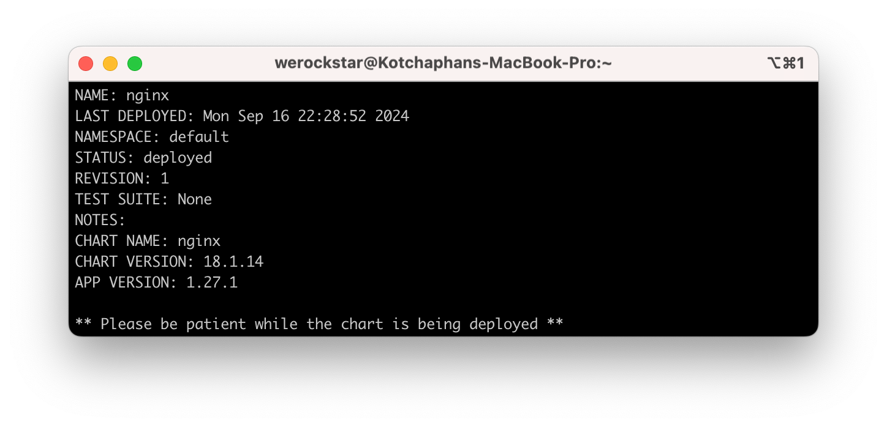

# Helm - Package Manager for Kubernetes

## Installation on MacOS

```bash
brew install helm
```

## Concepts

- **Release**: A release is a running instance of a Helm chart. It is created by installing a chart.
- **Chart**: A chart is a Helm package that contains all the resource definitions necessary to run an application, tool, or service inside a Kubernetes cluster.
- **Repository**: A repository is a collection of Helm charts that are published to a remote location such as artifact hub.
- **Lifecycle**: Helm lifecycle has two phases: install and upgrade.
- **Hook**: A hook is a piece of code that is executed at a specific point in the lifecycle of a release.

## Getting Started

```bash
helm --version

helm repo list

# list all installed releases
helm ls

# show helm environment variables
helm env
```

## Add Helm Repository

```bash
helm repo add <REPO_NAME> <REPO_URL>

# example. Add Airbyte Helm Repository
helm repo add airbyte https://airbytehq.github.io/helm-charts
```

## Search Helm Repository

Search Helm repository for available charts. If no repository is specified, it will search all repositories.

```bash
helm search repo <REPO_NAME>

# example. Search Airbyte Helm Repository
helm search repo airbyte
```

## Install Helm Chart

```bash
helm install <RELEASE_NAME> <REPO_NAME>

# example. Install Airbyte Helm Chart
helm install airbyte airbyte/airbyte

# Specific namespace for install
helm install airbyte airbyte/airbyte --namespace airbyte

# nginx is a name of release, and specific chart version (not same version for app version)
helm install nginx bitnami/nginx --version 16.0.6

# show status of release (or display all k8s resources)
helm status nginx --show-resources # --show-desc

# show values of helm chart
helm show values bitnami/nginx
helm show values bitnami/nginx > values.yaml
```

Note: While installing Helm chart, you can specify the namespace where the chart will be installed. Moreover, you will see metadata of the chart, such as chart version, application version, revision, status, and so on.


Written in [templates/NOTES.txt](https://github.com/bitnami/charts/blob/main/bitnami/nginx/templates/NOTES.txt)

## Upgrade Helm Chart

```bash
helm upgrade <RELEASE_NAME> <REPO_NAME>

# or install with upgrade
helm upgrade --install airflow apache-airflow/airflow

# update helm repository
helm repo update

# upgrade ngnix to latest version (nginx is a name of release)
helm upgrade nginx bitnami/nginx

# upgrade nginx with new tag
# App Version will be not changed
helm upgrade nginx bitnami/nginx --set image.tag=1.26-debian-12
```

## Uninstall Helm Release

```bash
helm uninstall <RELEASE_NAME>
```

## Revision History

```bash
helm history <RELEASE_NAME>

helm history nginx
```

## View Release Details

```bash
helm get values <RELEASE_NAME>

helm get values nginx

# status of release
helm status nginx

# k8s resources (what resources will be created)
helm status airflow --show-resources

# description message of release
helm status airflow --show-desc
```

## Rollback

```bash
helm rollback <RELEASE_NAME> <REVISION_NUMBER>

# example. Rollback to previous revision
helm rollback nginx 1

# check revision version
helm ls
```

Note: Helm rollback will create new revision.

## Pull Helm Chart

```bash
helm pull <REPO_NAME>

# example: nginx
helm pull bitnami/nginx

# extract helm chart
tar -xvf nginx-16.0.6.tgz
```
